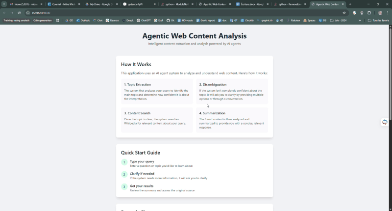
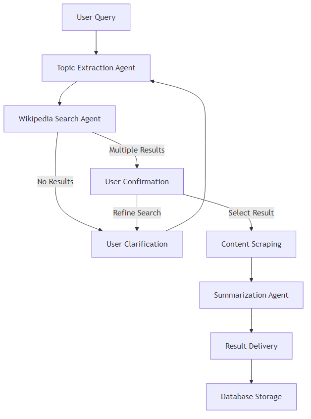

# Wikipedia Topic Explorer

A search and summarizing application that uses AI to search, analyze, and summarize Wikipedia articles. Built with FastAPI, LangChain, and PostgreSQL.

## Features

- **Topic Extraction**: Automatically identifies the main topic from user queries
- **Smart Disambiguation**: Handles ambiguous topics with interactive clarification
- **Efficient Summarization**: Uses map-reduce chain for processing large articles
- **Best matching Search**: Returns the best matching Wikipedia article for your topic
- **Persistent Storage**: Saves queries and results in PostgreSQL database
- **Real-time Processing**: Asynchronous processing with detailed logging
- **UI**: Clean, responsive interface with real-time updates

## Prerequisites

- Python 3.8+
- Docker and Docker Compose
- OpenAI API key

## Setup

1. Clone the repository:
```bash
git clone <repository-url>
cd wikipedia-topic-explorer
```

2. Create a `.env` file in the root directory:
```env
OPENAI_API_KEY=your_api_key_here
OPENAI_MODEL=gpt-3.5-turbo
WIKIPEDIA_LANGUAGE=en
```

3. Start the application using Docker Compose:
```bash
docker-compose up --build
```

The application will be available at `http://localhost:8000`


# Demo

Below is a demonstration of the workflow. It shows how the system responds to user queries and performs actions.




## Usage

1. Open your browser and navigate to `http://localhost:8000`
2. Enter a topic or question in the search box
3. The system will:
   - Extract the main topic
   - Search Wikipedia
   - Generate a concise summary
   - Display the results

### Example Queries

- "Tell me about artificial intelligence"
- "What is quantum computing?"
- "Explain the history of the internet"

## API Endpoints

The application provides two ways to interact with the Wikipedia summarization service:

### Main Application Endpoints
These endpoints provide the full interactive experience with topic extraction and disambiguation:

- `POST /api/v1/process`: Process a new query
  - Input: `{"query": "your search query"}`
  - Output: Returns search results for user confirmation
  - This is the first step in the two-step process

- `POST /api/v1/confirm`: Handle disambiguation selection
  - Input: `{"query_id": "id", "user_selected_option": "selected_url"}`
  - Output: Returns the final summary and article details
  - This is the second step after user selects an option

- `GET /api/v1/queries`: Get all saved queries
- `GET /api/v1/results`: Get all saved results
- `GET /api/v1/query/{query_id}`: Get a specific query and its results

### Simplified Summarize Endpoint
For simpler use cases, we provide a single endpoint that combines the process and confirm steps:

- `POST /api/v1/summarize`: One-step Wikipedia article summarization
  - Input: `{"query": "your search query"}`
  - Output: 
    ```json
    {
        "query": "your search query",
        "summary": "concise summary of the article",
        "source_url": "wikipedia article URL"
    }
    ```
  - This endpoint automatically:
    1. Extracts the main topic
    2. Finds the best matching Wikipedia article
    3. Generates a concise summary
    4. Returns the results in a simple format

The main difference between these approaches:
- The main application endpoints (`/process` and `/confirm`) provide more control and interactivity, allowing users to choose between multiple search results
- The `/summarize` endpoint is simpler and faster, automatically selecting the best matching article without user intervention

## Architecture

The application uses a multi-agent architecture:

1. **Topic Extractor**: Identifies the main topic from user queries
2. **Disambiguator**: Handles ambiguous topics with interactive clarification
3. **Wikipedia Searcher**: Retrieves relevant Wikipedia articles
4. **Summarizer**: Generates concise summaries using map-reduce chain

## Model Selection

The project currently uses **GPT-3.5-turbo**  as its primary language model. When selecting a model, it's best to aim for the most accurate and cost-effective option. Based on [OpenAI's documentation](https://platform.openai.com/docs/guides/model-selection) good strategy is to start with the most powerful available model, save the outputs, and then experiment with lighter models to find the right balance between quality and cost.

Since this is a test project, my main focus has been on ensuring functionality while keeping costs low (all prices available on [OpenAI's website](https://platform.openai.com/docs/pricing)). As described in the next section, we also had to make some architectural adjustments to continue using this model. The choice of GPT-3.5-turbo was based on the following considerations:

1. **Cost-Effectiveness**: GPT-3.5-turbo provides a balance between performance and cost compared to more advanced models like GPT-4.

2. **Task Suitability**: The model is well-suited for all core project tasks:
   - Topic extraction from user queries
   - Summarization of Wikipedia articles
   - Handling disambiguation
   - Generating concise summaries

3. **Technical Integration**: The model is integrated using LangChain, which provides support for GPT-3.5-turbo through the `langchain-openai` package.

4. **Performance Balance**: GPT-3.5-turbo offers optimal performance characteristics:
   - Fast response times
   - High-quality outputs
   - Efficient token usage
   - Appropriate context window size for processing Wikipedia articles

The model is configured through environment variables and can be easily modified in the application settings if needed.


## Challenges

The architecture of this repo evolved through experimentation:

1. **Initial Design**: The first iteration included a disambiguator that relied solely on the LLM to clarify ambiguous queries by generating JSON responses.

2. **Challenge**: During testing, we discovered that GPT-3.5-Turbo struggled to consistently follow the exact instructions for building correct JSON responses in the disambiguation process.

3. **Solution**: We implemented a more robust approach that:
   - First performs a Wikipedia search to gather potential topics
   - Uses these search results to create structured suggestions
   - Enhances the query with these suggestions for better topic extraction
   - This hybrid approach proved more reliable than depending solely on the LLM's JSON generation capabilities


## Workflow

The following diagram illustrates the agentic workflow of the application:



## Error Handling

The system includes comprehensive error handling:
- Context length management with prompt engineering
- Automatic retries with smaller chunks
- Detailed error logging


## Contributing

1. Fork the repository
2. Create a feature branch
3. Commit your changes
4. Push to the branch
5. Create a Pull Request

## License

This project is licensed under the MIT License - see the LICENSE file for details. 